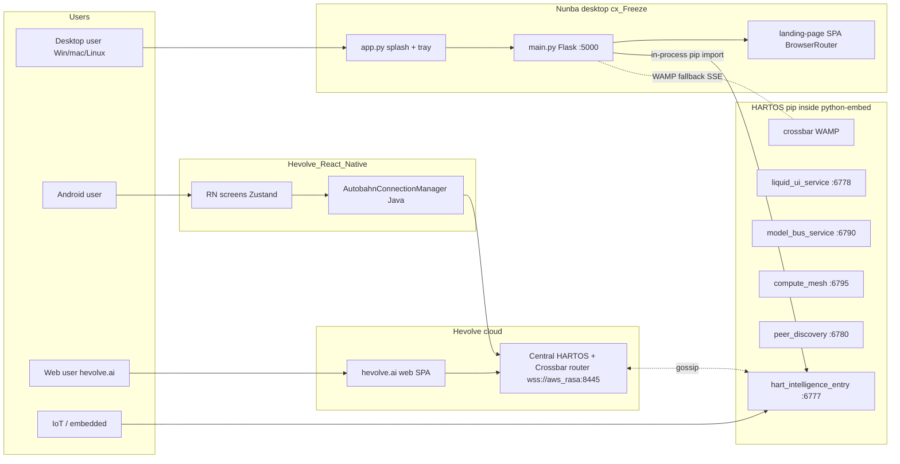
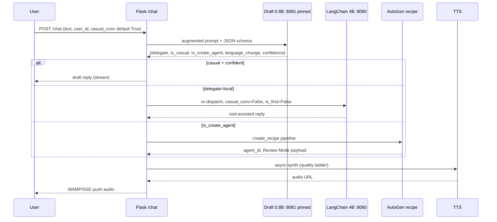
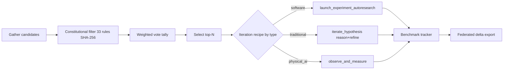

# Hive MoE Architecture Map — Nunba × HARTOS × HevolveAI

> Authoritative architecture + UAT journey map for the Nunba / HARTOS /
> HevolveAI ecosystem. This document is the single place a QA tester,
> integrator, or new contributor should start to understand what the
> system does end-to-end and how to verify it.
>
> When claims here disagree with code, code wins — but please update
> this map in the same PR. See the repo root's AI-agent-guidance doc, Gate 2 (DRY), before copying
> any table into another document.

---

## 1. Ecosystem Overview

### 1.1 The five repositories

| Repo | Role | Ships as | Key entry |
|---|---|---|---|
| **Hevolve_Database** | Canonical DB models (156+ tables, LMS + social). Uses `SocialUser`/`SocialPost` class names to avoid collision with legacy LMS models. | `pip install hevolve-database` | `sql/models.py` |
| **HARTOS** | Agentic runtime. 18 Flask blueprints, 195+ endpoints, 430+ REST routes in technical reference. Recipe pattern (CREATE/REUSE). Federation, hive, guardrails. | `pip install hart-backend` or Docker or NixOS | `hart_intelligence_entry.py` (port 6777) |
| **HevolveAI** | Native hive intelligence (Hebbian, Bayesian, RALT, world model, biometric ML). Source-protected binary, Ed25519-signed. | Pip transitive via HARTOS | In-process library |
| **Nunba-HART-Companion** | Desktop shell. Hosts HARTOS inside cx_Freeze bundle, serves its OWN React SPA at `/static`, runs Flask on port 5000. | cx_Freeze `.exe` / `.app` via Inno Setup + Azure Trusted Signing | `app.py` → `main.py` |
| **Hevolve** (cloud web) | hevolve.ai SPA (separate React codebase from Nunba). Hosted centrally. | CRA bundle deployed behind hevolve.ai | `src/index.js` |
| **Hevolve_React_Native** | Android app (90+ screens, Zustand stores, native WAMP via `AutobahnConnectionManager`). | Google Play APK | `App.js` |

The React Native project lives under `StudioProjects/Hevolve_React_Native`, everything else under `PycharmProjects/*`.

### 1.2 Dependency direction

```
Hevolve_Database (canonical DB)
        ▲
        │ pip
        │
HevolveAI (hive ML kernels, source-protected)
        ▲
        │ pip
        │
HARTOS (agentic runtime)
        ▲
        │ pip (bundled inside cx_Freeze's site-packages)
        │
Nunba-HART-Companion (desktop shell) ─── serves ──▶ landing-page/ React SPA
                                                   (BrowserRouter — NOT HashRouter)

Hevolve (web SPA) ── REST / WAMP ──▶ HARTOS regional/central (hevolve.ai)
Hevolve_React_Native ── native Java WAMP ──▶ HARTOS regional/central
```

Nunba **must not** own its own `core/`, `integrations/`, `security/`, or `models/` packages — those live in HARTOS and are imported through `site-packages`. Namespace collision under cx_Freeze silently hides whichever `__init__.py` loads second (see the repo root's AI-agent-guidance doc, Gate 6, and `memory/feedback_frozen_build_pitfalls.md`).

### 1.3 Topology tiers

| Topology | DB engine | Pool | Typical deployment | Peer budget | Role |
|---|---|---|---|---|---|
| **flat** | SQLite (`NullPool`, WAL, `busy_timeout=3s`) | N/A single writer | Desktop (Nunba cx_Freeze), IoT/embedded | 10 links | User's own compute |
| **regional** | MySQL (`QueuePool` size=20 via `HEVOLVE_DB_URL`) | 20 | LAN/edge GPU hub, moderator node, gossip aggregator | 50 links | Moderator, earns revenue |
| **central** | MySQL (same conn string shape) | 20 | hevolve.ai cloud | 200 links | Master-key holder, telemetry, kill switch |

`HEVOLVE_NODE_TIER` env var selects topology (legacy name — it means topology, NOT capability tier). Deploy directories map as follows: `cloud/` → central, `distributed/` → central + workers, `linux/` → regional/flat, `distro/` → regional (NixOS), `embedded/` → flat (headless), `remote/` → regional.

### 1.4 Runtime surfaces



---

## 2. Mixture-of-Experts Layer

The core routing design: a tiny draft model classifies every turn; only hard turns wake the big model. Then agentic decomposition, recipe replay, and hive federation layer on top.

### 2.1 Three-tier intent classification

| Tier | Who | When | Cost |
|---|---|---|---|
| **Tier 1** | Deterministic rules in `chatbot_routes.py` | Static shortcuts only (health, ping, admin probe) | 0 ms |
| **Tier 2** | LangChain Create_Agent / CustomGPT on 4B | Tool-assisted turns — the default agentic path | 1–10 s |
| **Tier 3** | AutoGen multi-agent (`create_recipe.py` / `reuse_recipe.py`) | Agent creation pipeline, multi-step recipes | 5–60 s |

### 2.2 Draft-first dispatcher (THE MoE gate)

Every `/chat` turn hits the **0.8B Qwen3.5 draft** on port **:8081** first. The draft is the ONLY classifier — no Python regex, no keyword tables. It returns a structured JSON envelope:

```json
{
  "reply": "Hey! How can I help?",
  "delegate": "none",
  "is_casual": true,
  "is_correction": false,
  "is_create_agent": false,
  "channel_connect": null,
  "language_change": null,
  "confidence": 0.95
}
```

Decision rules:
- `delegate=none` AND `confidence>=0.85` → draft reply returned directly (~300 ms).
- `delegate=local` → re-dispatch to 4B LangChain Agent with full tool chain.
- `is_create_agent=true` → AutoGen agent-creation pipeline.
- `channel_connect=<adapter>` → channel setup flow.
- `language_change=<iso>` → overrides `preferred_lang`, persists via `core.user_lang.set_preferred_lang` (single writer of `hart_language.json`).



### 2.3 `casual_conv` flag — the MoE routing key

| Value | Backend | Tools |
|---|---|---|
| `casual_conv=True` (default) | 0.8B draft via `DRAFT_GPT_API` | none — `is_first=True` minimal |
| `casual_conv=False` | 4B main via `GPT_API` | exhaustive — `is_first=False` |

`casual_conv=False` is set when any of these are present: `agent_id`, `prompt_id`, `create_agent=True`, `agentic_execute=True`, `agentic_plan`, or `autonomous_creation=True`.

ALL frontends (Nunba web, Hevolve web, React Native) must send `casual_conv`. Default-agent pure chat is the ONLY valid `casual_conv=True` case.

### 2.4 Agent creation pipeline (Steps 1-20)

Agent_status lifecycle: **Creation Mode → Review Mode → completed → Evaluation Mode → Reuse Mode**. Plus Plan Mode (Agentic_Router) and Speculative Mode.

Autonomous creation: `autonomous_creation=True` flag + frontend `autoContinueFlag` auto-sends "proceed" until Review Mode is reached. See `project_agentic_capabilities.md`.

### 2.5 Distributed coding agent (Steps 21-32)

Service Tool Registry + `agent_ledger` distributed primitives (Redis or in-memory). `DistributedTaskCoordinator` shards sub-goals across peers. `VerificationProtocol` proves work before reward.

7 API endpoints at `/api/distributed/*`. Notifications: `goal_contribution` and `goal_verified` via `NotificationService` + SSE/WAMP.

### 2.6 Auto-evolve

`AutoEvolveOrchestrator` (`HARTOS/integrations/agent_engine/auto_evolve.py`):



Owner pause/resume: experiment creator can pause iteration with `pause_experiment_evolution`; only they can resume. Stored in-memory under `_pause_lock`.

### 2.7 Cultural wisdom + TrustQuarantine

`cultural_wisdom.py` encodes 30 traits. `get_cultural_prompt()` feeds AutoGen; `get_cultural_prompt_compact()` feeds LangChain. TrustQuarantine has 4 levels and is an immutable layer in `hive_guardrails.py`.

---

## 3. Data & Realtime Plane

### 3.1 DB topology mapping

| Topology | Engine | Driver | Migration story |
|---|---|---|---|
| flat | SQLite at `~/Documents/Nunba/data/hevolve_database.db` + `nunba_social.db` + `memory_graph/*` | NullPool, WAL, busy_timeout=3s | `run_migrations()` invoked by `main.py` after `init_db()` |
| regional | MySQL via `HEVOLVE_DB_URL` | QueuePool size=20 | Alembic from `Hevolve_Database/alembic/` |
| central | MySQL (same `HEVOLVE_DB_URL` shape) | QueuePool size=20 | Alembic; canonical schema |

SQLite is NOT suitable for regional — no cross-instance sync, single-writer bottleneck. MySQL is canonical.

Canonical DB source: `Hevolve_Database/sql/models.py` (`SocialUser`/`SocialPost`/`SocialComment`). HARTOS `_models_local.py` is the standalone fallback (uses `User`/`Post` — no collision in standalone). New models go in BOTH.

Recent migrations to be aware of:
- **v15** — adds `role` column to `users`, backfills from `is_admin`/`is_moderator`.
- **v16** — adds `is_hidden` columns to `posts` and `comments`.

### 3.2 User-writable data paths

Canonicalized in `core.platform_paths`:

| Path | Purpose |
|---|---|
| `~/Documents/Nunba/data/` | DBs, `hart_language.json`, `agent_data/`, `memory_graph/` |
| `~/Documents/Nunba/logs/` | `gui_app.log`, `server.log`, `langchain.log`, `startup_trace.log`, `frozen_debug.log` |
| `~/.nunba/site-packages/` | Runtime-pip-installed packages (CUDA torch, TTS engines, parler-tts) |
| `~/.nunba/llama_config.json` | LLM endpoint + `first_run` flag for wizard bypass |
| `%LOCALAPPDATA%/Nunba/mcp.token` | MCP bearer token (Windows) |

NEVER write to `C:\Program Files (x86)\HevolveAI\Nunba\` — read-only for non-admin users.

### 3.3 Crossbar WAMP realtime plane

Primary transport for central/regional. SSE is fallback for flat/desktop.

| Topology | Primary | Fallback |
|---|---|---|
| central/regional | Crossbar WAMP (`wss://aws_rasa.hertzai.com:8445/wss`) | REST polling |
| flat/desktop | Local SSE (`localhost:5000/api/social/events/stream`) | REST polling |

**Per-user topics:**
- `com.hertzai.pupit.{userId}` — video/media
- `com.hertzai.hevolve.analogy.{userId}` — analogy engine
- `com.hertzai.hevolve.chat.{userId}` — chat responses, thinking traces
- `com.hertzai.hevolve.{userId}` — general events
- `com.hertzai.bookparsing.{userId}` — book parsing progress
- `com.hertzai.hevolve.social.{userId}` — social notifications/votes/achievements

**Per-session topics:**
- `com.hertzai.hevolve.game.{sessionId}` — multiplayer game state

Web uses a Web Worker (`crossbarWorker.js`) + bridges (`realtimeService.js`, `gameRealtimeService.js`). React Native uses native Java `AutobahnConnectionManager` → `DeviceEventEmitter` → `services/realtimeService.js`.

Backend publishes to WAMP AND calls `_broadcast_sse_fallback()` for flat users. `realtime.py` is the canonical dispatcher.

NEVER use raw WebSockets or long-polling as primary transport. NEVER bypass these two channels for new real-time features.

### 3.4 Memory system

- **MemoryGraph** — SQLite FTS5 + `memory_links` at `~/Documents/Nunba/data/memory_graph/`. 5 tools: `remember`, `recall_memory`, `backtrace_memory`, `get_memory_context`, `record_lifecycle_event`. Wired into LangChain (`get_tools`/`prep_outputs`) and AutoGen (`reuse_recipe`/`create_recipe`).
- **SimpleMem** — semantic vector search.
- **PersistentChatHistory** — single buffer shared between LangChain and AutoGen (zero redundancy).
- **ConversationEntry** — cross-channel unified log.
- **Visual context** — Redis key-value store keyed by `user_id`. `VideoSession.process_frame()` → 3-frame deque → pickle to Redis. `parse_visual_context()` tool calls local MiniCPM :9890 first, then cloud `azurekong.hertzai.com:8000/minicpm`. NOT semantic memory — stateless per-request, temporal filter only (last 5 min).

---

## 4. Model & Compute Plane

### 4.1 Unified model catalog

Canonical in HARTOS: `HARTOS/integrations/service_tools/model_catalog.py` + `model_orchestrator.py`. JSON-backed at `~/Documents/Nunba/data/model_catalog.json`. Populator pattern: subsystems register via `catalog.register_populator(name, fn)`. Built-in populators: STT, VLM. Nunba registers: LLM (llama_installer), TTS (tts_engine).

Nunba shims live at `models/catalog.py` and `models/orchestrator.py` (these shims re-export HARTOS types and share singletons via `_hartos_mod._catalog_instance`). Do NOT duplicate logic here — they are **shims** not reimplementations.

### 4.2 Capability tier (hardware)

Source: `HARTOS/security/system_requirements.py`. Auto-detected via `classify_tier()`.

| Tier | CPU | RAM | Disk | VRAM | Features unlocked |
|---|---|---|---|---|---|
| `embedded` | any | any | any | — | gossip, sensors, GPIO, MQTT |
| `observer` | 1 | 2 GB | — | — | + Flask server |
| `lite` | 2 | 4 GB | 1 GB | — | + cloud chat, vision_lightweight, crawl4ai |
| `standard` | 4 | 8 GB | 2 GB | — | + TTS, Whisper, coding_agent, goal engine |
| `full` | 8 | 16 GB | 20 GB | 8 GB | + video gen, media agent, local LLM, MiniCPM |
| `compute_host` | 16 | 32 GB | 100 GB | 12 GB | + regional host, large LLM |

Env override: `HEVOLVE_FORCE_TIER=lite`. Feature gates: `HEVOLVE_WHISPER_ENABLED`, `HEVOLVE_TTS_ENABLED`, etc.

### 4.3 Model lifecycle (VRAM + crash recovery)

`ModelLifecycleManager` properties:
- Verifies every loaded model's process is alive each tick.
- Classifies crashes by exit code: 137/-9 = OOM → downgrade (GPU → CPU_offload → CPU). Other → restart with exponential backoff (5s → 300s cap). Max 3 restarts.
- Swap queue: when B evicts A, A is queued (max 8). When B idles, A auto-restored.
- Pressure alerts: debounced EventBus `system.pressure` events for VRAM/RAM/CPU/disk.

| Model | Port | VRAM | Lifecycle | Purpose |
|---|---|---|---|---|
| 0.8B Qwen3.5 draft | :8081 | ~1.5 GB | `pinned=True` (never evicted) | Draft-first classifier + casual chat |
| 4B Qwen3.5 main | :8080 | ~3.5 GB | `pressure_evict_only=True` | Tool-assisted reasoning |
| STT/TTS/VLM | varies | varies | default (idle eviction) | one-shot tasks |

Language-triggered eviction: when user switches to a non-Latin language (Tamil, Hindi, etc.), `core.user_lang.on_lang_change` fires and `model_lifecycle._evict_draft_on_non_latin_switch` subscribes — the 0.8B draft is evicted because it hallucinates for non-Latin scripts, and the main model handles the turn alone.

### 4.4 TTS engine ladder

Preference is quality-ordered per-language. First runnable engine wins. On failure, cascade to next. Downloaded/loaded state does NOT affect selection — only quality + runtime capability matter.

**English ladder:**
1. Chatterbox Turbo (0.95 quality, GPU, voice clone) — needs 3.8 GB VRAM
2. F5-TTS (0.91, GPU, EN/ZH voice clone) — auto-installed via `~/.nunba/site-packages/`
3. LuxTTS (0.93, CPU, English voice clone)
4. Indic Parler (0.90, GPU, 22 Indic + English)
5. Kokoro (0.88, GPU preferred, English) — needs espeak-ng
6. Pocket-TTS (0.85, CPU, English voice clone)
7. Piper (0.70, CPU, multilingual) — bundled, always available
8. espeak (0.40, CPU, 100+ languages) — ultimate fallback

**Indic (Hindi, Tamil, Telugu, Bengali, Marathi, etc.):** `indic_parler → chatterbox_ml → espeak`. Indic Parler MUST auto-download on first Indic-language request.

**CJK (Chinese, Japanese, Korean):** `cosyvoice3 → f5_tts → chatterbox_ml → espeak`.

TTS API:
- `POST /api/social/tts/quick` — immediate audio for short text
- `POST /api/social/tts/submit` — async job
- `GET /api/social/tts/status/:taskId` — poll

### 4.5 STT (Whisper) and VLM

STT endpoint: `POST /voice/transcribe`. Auto-selects model by VRAM: `tiny` (<2 GB), `base` (2–4), `small` (4–8), `medium` (8+). Diarization sidecar on port 8004 (WebSocket), requires HuggingFace token for pyannote.

VLM: MiniCPM. Local :9890 is tried before cloud `azurekong.hertzai.com:8000/minicpm`.

### 4.6 Provider gateway (cloud MoE)

`HARTOS/integrations/providers/`:
- `registry.py` — 15 providers (Together, Groq, Fireworks, DeepInfra, Cerebras, SambaNova, OpenRouter, Replicate, fal.ai, HuggingFace + RunwayML, ElevenLabs, Midjourney, Pika, Kling, Luma, Seedance, Sora + local).
- `gateway.py` — smart router with OpenAI/Replicate/fal/custom formats, fallback chain, cost tracking.
- `efficiency_matrix.py` — continuous benchmarking (tok/s, latency, quality, cost, reliability). EMA smoothing. Runs during idle via `ResourceGovernor`.
- `agent_tools.py` — LangChain tools: `Cloud_LLM`, `Generate_Image`, `Generate_Video`, `List_AI_Providers`, `Provider_Leaderboard`.

---

## 5. Security & Supply Chain

### 5.1 Master key exclusion

`HEVOLVE_MASTER_PRIVATE_KEY` is a kill switch for the distributed intelligence. It is held by human stewards, inaccessible to AI. Any AI agent **MUST NEVER** read, print, or derive this key. See the HARTOS root AI-agent-guidance doc, § Master Key - AI Exclusion Zone.

### 5.2 3-tier role system

| Role | Access | Where |
|---|---|---|
| `central` | Cloud admin | Master-key holder |
| `regional` | Moderator, runs regional node, earns revenue | LAN/edge hub |
| `flat` | Registered local user | Desktop / mobile |
| `guest` | Anonymous (name only, no email/password), full UX access | Desktop default |
| `anonymous` | — | Pre-auth |

Backend: `role` column on `User`, JWT `role` claim, `@require_central` / `@require_regional` decorators. Frontend: `RoleGuard` component + `useRoleAccess()` hook (`components/RoleGuard.js`). `SocialContext` provides `accessTier` — defaults to `flat` for authenticated users without role field. `SocialProvider` wraps both `/social` and `/admin` routes (in `App.js`).

Write guards: `canWrite` controls FAB (FeedPage), vote handlers (PostCard), CommentForm (PostDetailPage).

### 5.3 Hub allowlist + model install gates

`core.hub_allowlist.HubAllowlist` is the single source of trusted HF orgs (there used to be two parallel sets — this consolidation is guarded by `tests/test_hub_install_safety.py` with 22 tests).

Four supply-chain gates on `/api/admin/models/hub/install`:
1. **Repo must be in allowlist** (org-level).
2. **Manifest signature verified** (Ed25519).
3. **Size + disk budget check**.
4. **Tier check** (`min_capability_tier` vs current node).

### 5.4 MCP bearer auth

HARTOS MCP HTTP bridge at `/api/mcp/local/*`. Bearer token stored at `%LOCALAPPDATA%/Nunba/mcp.token` (Windows). External MCP client configs use `type: "http"` + `url`, not `command`/`args` — such clients are pure MCP consumers, they MUST NEVER spawn or host an MCP server locally.

### 5.5 Hive guardrails

10-class guardrail network (frozen, crypto-verified SHA-256 every 300 s). Ed25519 master key, 3-tier certificate chain, HevolveArmor (Rust AES-256-GCM source protection), node watchdog. `HiveCircuitBreaker` in `security/hive_guardrails.py` is structurally immutable; do not modify.

Constitutional rules propagate to every connected hive — federation will refuse to connect to a hive whose values don't match byte-for-byte.

### 5.6 Frontend sanitization

- `DOMPurify.sanitize()` wraps every `dangerouslySetInnerHTML`.
- `eslint-plugin-security` enforces pattern checks.
- CI quality gate: `ruff` + `pip-audit` hard-gated, ESLint hard-gated (<1500 warn), Jest hard-gated, Cypress hard-gated.

---

## 6. Channels & Integrations

### 6.1 Channel adapters (31)

Telegram, Discord, Slack, WhatsApp, Signal, iMessage, Teams, Matrix, Mattermost, LINE, Messenger, Instagram, Twitter, Viber, WeChat, Zalo, Twitch, Nostr, Tlon, OpenProse, BlueBubbles, RocketChat, Nextcloud, Email, Voice, Hardware, Web + user-account bridges.

AutoGen tools: `send_to_channel`, `register_channel`, `list_channels`, `get_channel_context`.

Admin API at `/api/admin/channels/*` (part of the channels `admin_bp` — NOT the social admin).

### 6.2 Two admin blueprints

- **Channels admin** (`integrations/channels/admin/api.py`) at `/api/admin/*` — 100+ endpoints for settings/config, identity, channels, workflows, metrics, plugins, sessions. In-memory `AdminAPI` singleton + JSON file persistence. Auth via `before_request` hook that checks JWT Bearer + `is_admin`.
- **Social admin** (`integrations/social/api.py`) at `/api/social/admin/*` — users, stats, moderation, logs. Uses `@require_admin`/`@require_moderator` decorators + SQLAlchemy.

Frontend clients: `socialApi` (base `/api/social`) for social admin, `adminApiClient` (base `/api/admin`) for channels admin.

Settings = `/api/admin/config/*`, Identity = `/api/admin/identity/*`, Workflows = `/api/admin/automation/workflows/*`, Metrics = `/api/admin/metrics/*`.

### 6.3 Social feed

Feed at `/social` (index), NOT `/social/feed`. BrowserRouter (not Hash). `init_social(app)` registers `gamification_bp`, `discovery_bp`, AND `admin_bp` (channels admin). Main `social_bp` (auth, users, posts, feed, comments) registered separately. `main.py` calls `run_migrations()` after `init_db()` to add new DB columns. Unlocks 195+ total API routes.

Auth API format: `POST /api/social/auth/register` returns `{success, data: {id, username, api_token, ...}}` (no JWT). `POST /api/social/auth/login` returns `{success, data: {token: "JWT...", user}}`. Register THEN login to get JWT. Auth header: `Authorization: Bearer <JWT>`.

### 6.4 Kids media pipeline

Backend:
- `media_classification.py` (5 labels: public_educational, public_community, user_private, agent_private, confidential).
- `kids_media_routes.py` — `/api/media/asset` (image/tts/music/video), `/api/media/asset/status/<job_id>`.

Frontend:
- `GameAssetService.js` — 3-tier (IndexedDB → backend → null).
- `GameItemImage.jsx` — image + emoji fallback.
- `MediaPreloader.js` — batch pre-caching.

Security: JWT auth on media routes via `_get_user_id_from_request()`, path-traversal prevention (`_sanitize_id()`, realpath validation), input validation (max prompt length, valid media types/styles/classifications), job TTL cleanup (600 s), max 500 concurrent jobs. iOS AudioContext user-gesture unlock in `AudioChannelManager.js`.

### 6.5 Cross-repo frontend rule

**Frontend changes must go to BOTH Hevolve AND Nunba-HART-Companion.** Nunba's `landing-page/src/` is NOT a symlink to Hevolve. Changes to Hevolve web do NOT auto-propagate to Nunba. Android is a separate codebase again.

---

## 7. Deployment Surfaces

### 7.1 Nunba desktop

- cx_Freeze bundle: `scripts/build.py` runs preflight (20 GB disk + psutil), then cx_Freeze + installer.
- Installer places app at `C:\Program Files (x86)\HevolveAI\Nunba\`.
- Inno Setup post-install task `--setup-ai` (dark-themed Tkinter wizard, #0F0E17 bg, #6C63FF accent). Card-based options: local llama.cpp download / cloud API / custom endpoint. Writes `~/.nunba/llama_config.json` with `first_run: false`. Wizard exits with `sys.exit(0)`; installer uses `waituntilterminated`.
- Azure Trusted Signing for the `.exe`.
- Launch on install checked by default (unified flow).
- Logs: `~/Documents/Nunba/logs/{gui_app,server,langchain,startup_trace,frozen_debug}.log`.

### 7.2 HARTOS regional/cloud

- `pip install hart-backend` + Waitress on port 6777 for standalone.
- `docker compose up` with Redis + Crossbar + workers.
- NixOS deploy: `deploy/cloud|distributed|linux|distro|embedded|remote`.
- Peer discovery UDP gossip beacon on 6780 (app) / 678 (OS).

### 7.3 Hevolve React Native

- Zustand stores (conversation, channel, kids, fleet, gamification, experiment, etc.).
- Shared Liquid UI components, `LiquidOverlay`, `NunbaKeyboard`, `SocialLiquidUI`.
- Palette: `#0F0E17` / `#6C63FF` / `#FF6B6B` (aligned with web).
- Native WAMP client via `io.crossbar.autobahn` in `AutobahnConnectionManager.java`.
- `DeviceEventEmitter` bridges native → JS.

### 7.4 CI / GitHub Actions

| Workflow | Jobs | Gate |
|---|---|---|
| `quality.yml` | python-quality (3-OS matrix), frontend-quality (ubuntu), cypress-e2e (4-shard ubuntu + windows smoke) | ruff/pytest/pip-audit hard-gated; ESLint hard-gated (<1500 warn); Jest hard-gated; Cypress hard-gated |
| `e2e-staging.yml` | docker-compose up → 8 probes → down | push / nightly |
| `docs.yml` | MkDocs build + deploy | on push |
| `build.yml` | cx_Freeze installer + Azure Trusted Signing | on tag |

---

## 8. User Journeys for UAT

> Every journey below is end-to-end observable — log lines, UI states, WAMP topic messages, or DB rows. Tester should run them in order of risk (J01 first, J15 last).

### J01 — Fresh-install first-run (desktop happy path)

**Precondition:** Windows machine with no prior Nunba install. `%USERPROFILE%\Documents\Nunba` does not exist. GPU present (8 GB+ recommended) but CPU fallback must also work.

**Steps:**
1. Run the signed `Nunba-Setup.exe`.
2. Accept license, keep "Launch Nunba" checked, click Install.
3. Inno Setup triggers `--setup-ai` — dark-themed Tkinter wizard appears.
4. Pick "Local llama.cpp (recommended)". Wizard downloads Qwen3-4B GGUF + 0.8B draft GGUF (~4 GB).
5. Wizard closes with `sys.exit(0)`. `app.py` starts splash + tray, then webview.
6. `LightYourHART` onboarding renders: two questions (passion, escape), Canvas particles, ambient audio, pre-synth voice.
7. `WelcomeBridge` POSTs to `/api/ai/bootstrap`. Background thread detects hardware, plans TTS + STT + VLM pipeline, downloads anything missing. Frontend polls `/api/ai/bootstrap/status`.
8. First chat turn: user types "hi".

**Expected observables:**
- `logs/gui_app.log`: `splash shown`, `tray ready`, `webview loaded`.
- `logs/startup_trace.log`: lines from `main.py:57` including `NUNBA_BUNDLED=1`.
- `logs/server.log`: `llama-server :8080 up`, `draft :8081 up`, `/chat returning in <500ms`.
- `~/.nunba/llama_config.json` has `first_run: false`.
- `~/Documents/Nunba/data/nunba_db.sqlite` exists with `actions`, `conversations`, `pdf_files`, `page_layouts` tables.
- UI: landing page loads, model-source badge shows "Local".

**Fail signals:**
- Wizard dies without writing `first_run: false` → next launch will re-open wizard.
- `logs/frozen_debug.log` reports `ModuleNotFoundError: No module named 'core.X'` → cx_Freeze missed a module in `scripts/setup_freeze_nunba.py` packages[] (Gate 6 regression).
- First chat turn exceeds 2 s → draft not pinned or draft not responding.

**Cross-repo touchpoints:** Nunba (`app.py`, `main.py`, `desktop/ai_installer`), HARTOS (pip loaded, `hart_intelligence_entry`), Hevolve_Database (migrations).

---

### J02 — Draft-first dispatcher handles casual chat (no escalation)

**Precondition:** App running, user logged in (or guest), English preferred language.

**Steps:**
1. Type "hey, how are you?" in the chat input.
2. Submit.

**Expected observables:**
- `logs/server.log`: `POST /chat casual_conv=True`, `draft classifier 8081`, response in ~300 ms.
- Draft JSON envelope logged: `{"delegate":"none","is_casual":true,"confidence":0.9x}`.
- TTS fires for the reply via `/api/social/tts/quick`.
- WAMP topic `com.hertzai.hevolve.chat.{userId}` receives a `priority=49, action="Thinking"` message followed by final text.
- UI shows chat bubble; source badge = "Local".

**Fail signals:**
- Server log shows `LangChain tool chain invoked` → draft should have handled it. Escalation is a regression.
- Response > 1 s → draft not pinned in VRAM or evicted.

**Cross-repo touchpoints:** Nunba (`routes/chat*`), HARTOS (`speculative_dispatcher.py`, `hart_intelligence_entry`).

---

### J03 — Language switch to Tamil (non-Latin) evicts the draft

**Precondition:** App running, English default.

**Steps:**
1. In chat, send: "switch to Tamil please".
2. Wait for the draft to classify (language_change=ta).
3. Send a follow-up Tamil message.

**Expected observables:**
- Draft envelope: `{"language_change":"ta","delegate":"local"}`.
- `~/Documents/Nunba/data/hart_language.json` now contains `{"lang":"ta"}`. **Single writer** is `core.user_lang.set_preferred_lang`.
- `logs/server.log`: `on_lang_change fired`, `_evict_draft_on_non_latin_switch: evicting draft (non-Latin)`.
- VRAM monitor (`/api/admin/diag/vram`) shows draft unloaded; 4B still loaded.
- Indic Parler TTS ladder kicks in — if not installed, auto-installer fires (see `SetupProgressCard` in chat).
- TTS returns Tamil audio.

**Fail signals:**
- `hart_language.json` written by any caller other than `core.user_lang.set_preferred_lang` → parallel-path regression.
- Tamil audio synthesized by Piper CPU → Indic Parler preference walk failed. Should cascade to `chatterbox_ml → espeak` only as final fallback.
- Draft still loaded in VRAM → eviction subscriber did not fire.

**Cross-repo touchpoints:** Nunba (`core/constants.NON_LATIN_SCRIPT_LANGS`, `core/user_lang.py`), HARTOS (`model_lifecycle`, `tts_engine`, `integrations/indic_parler`).

---

### J04 — Voice turn: Whisper STT → chat → TTS synth

**Precondition:** Microphone permission granted. Whisper auto-selected (tier ≥ standard).

**Steps:**
1. Click mic icon. Speak "What's the weather in Bangalore?" and release.
2. Wait for transcription + reply.

**Expected observables:**
- `POST /voice/transcribe` returns transcript text.
- Transcript populates input box.
- Chat turn routes through draft → `delegate=local` (requires web search tool) → LangChain 4B with Web_Search tool.
- Reply streamed to UI; TTS quality-ordered ladder walks English: Chatterbox Turbo → F5 → LuxTTS → Indic Parler → Kokoro → Pocket-TTS → Piper → espeak.
- WAMP `com.hertzai.hevolve.chat.{userId}` pushes final audio URL.
- Audio plays automatically.

**Fail signals:**
- Transcript empty → Whisper model too small; check tier + VRAM.
- Reply rendered via Piper immediately → quality ladder skipped.
- UI doesn't autoplay → iOS AudioContext user-gesture unlock missing (`AudioChannelManager.js`).

**Cross-repo touchpoints:** Nunba (STT route), HARTOS (`tts_engine`, `Web_Search` tool in `provider-gateway`).

---

### J05 — Camera consent → visual-context tool invocation

**Precondition:** User logged in with flat role. Camera available.

**Steps:**
1. In settings, enable camera. Agent shows consent prompt per `design-philosophy` Agent Consent Model — user accepts.
2. WebSocket opens on port 5459; `VideoSession.process_frame()` runs the 3-frame deque.
3. Ask "What do you see?"

**Expected observables:**
- Redis key `visual_context:{user_id}` exists with pickled JPEG.
- Chat turn has `casual_conv=False` implicitly (agentic flow). LangChain uses `Visual_Context_Camera` tool.
- Tool logs: `parse_visual_context()` tries `localhost:9890/minicpm` first, cloud `azurekong.hertzai.com:8000/minicpm` second.
- Action API row created with `gpt3_label='Visual Context'`.
- Reply mentions what's on-camera.

**Fail signals:**
- Agent answers without looking → tool not invoked (check tool registration + `casual_conv=False`).
- Cloud hit before local → local :9890 fallback order broken.
- Camera stream continues after user revokes consent → consent model broken.

**Cross-repo touchpoints:** Nunba (`video.py` WebSocket), HARTOS (Visual_Context tool, action API mapping).

---

### J06 — Social register → login → post → feed → comment

**Precondition:** App running, no user logged in.

**Steps:**
1. Navigate to `/social`.
2. Click Register. Create user.
3. Log in (separate call).
4. Create a post in FeedPage.
5. Comment on the post.
6. Upvote the post.

**Expected observables:**
- Register → response shape `{success, data: {id, username, api_token, ...}}` (no JWT).
- Login → `{success, data: {token: "JWT...", user: {id, role, ...}}}`.
- JWT stored in localStorage. `Authorization: Bearer <JWT>` on subsequent calls.
- POST `/api/social/posts` returns row in `nunba_social.db`.
- WAMP `com.hertzai.hevolve.social.{userId}` receives notification for self (and any followers).
- SSE fallback fires on flat (`/api/social/events/stream`).
- Unread count updates via `realtimeService.on('notification')`.
- Comment appears immediately in PostDetailPage.
- Upvote: PostCard vote handler gated by `canWrite` (flat+ role).

**Fail signals:**
- Register returns JWT directly → contract changed; update frontend.
- Feed at `/social/feed` instead of `/social` → routing regression.
- FAB visible for guest/anonymous → `canWrite` gate missing.

**Cross-repo touchpoints:** Nunba landing-page, Hevolve cloud web (must mirror), HARTOS `integrations/social/api.py`, Hevolve_Database models.

---

### J07 — Admin model install via HF Hub (supply-chain gates)

**Precondition:** Central or regional admin. `HubAllowlist` seeded.

**Steps:**
1. Navigate to `/admin/models`.
2. Click "Hub Search". Search `Qwen`.
3. Select a model NOT in allowlist — attempt install.
4. Select an allowlisted model with oversize disk footprint — attempt install.
5. Select an allowlisted model of reasonable size — install.

**Expected observables:**
- Step 3 rejected with `403 org not in allowlist`. Tester can observe in `/api/admin/models/hub/install` response.
- Step 4 rejected at Gate 3 (size/disk).
- Step 5 passes all 4 gates. Model appears in `~/Documents/Nunba/data/model_catalog.json`.
- Post-install: `notify_downloaded` fires; `ModelCatalog` singleton updated; admin UI list refreshes.

**Fail signals:**
- Untrusted org install succeeds → Gate 1 regression. Check `core.hub_allowlist` is the ONE source; no hardcoded `_TRUSTED_HF_ORGS` set elsewhere.
- Oversize install succeeds → Gate 3 broken.
- Catalog written but lifecycle manager unaware → `notify_downloaded` not called by that bypass path.

**Cross-repo touchpoints:** Nunba `scripts/setup_freeze_nunba.py` (if new module), HARTOS `integrations/service_tools/model_catalog.py`, HARTOS hub download orchestrator.

---

### J08 — Kids mode template game

**Precondition:** User logged in. Kids hub accessible.

**Steps:**
1. Navigate to kids hub.
2. Pick a MatchPairs template.
3. Play a round that requires 5 item images + 3 short TTS voiceovers.

**Expected observables:**
- `MediaPreloader.js` fires a batch pre-cache on template load (`GET /api/media/asset?kind=image&id=...`).
- Resolution order: IndexedDB hit → backend fetch → null (emoji fallback via `GameItemImage.jsx`).
- TTS voiceovers via `/api/social/tts/quick`.
- `media_classification.py` returns `public_educational` labels.
- UI shows no broken images; audio plays on tap.

**Fail signals:**
- Every asset request hits the backend → IndexedDB caching broken.
- Emoji fallback shown when backend image was available → `GameItemImage` order wrong.
- TTS uses wrong ladder for Tamil assets → language plumbing missing.

**Cross-repo touchpoints:** Nunba landing-page, HARTOS `kids_media_routes`, HARTOS `tts_engine`.

---

### J09 — Multi-device agent sync

**Precondition:** Same user logged in on desktop Nunba AND Android RN.

**Steps:**
1. On desktop, train an agent (Creation Mode → Review Mode → completed).
2. On Android, open the agent drawer.

**Expected observables:**
- Desktop: POST `/agents/sync` with current agent state.
- Android: GET `/agents/sync` returns the new agent.
- `localStorage.active_agent_id` set on both devices.
- `intelligencePreference` respected per device (auto / local_only / hive_preferred).
- If the user migrates: POST `/agents/migrate` moves lineage.

**Fail signals:**
- Agent only visible on the device that trained it → sync route silent-failing (check `agent_data` filesystem write permission — `C:\Program Files` trap).
- Migration loses conversation history → `PersistentChatHistory` not ported.

**Cross-repo touchpoints:** Nunba, HARTOS `integrations/agent_engine`, Hevolve_React_Native.

---

### J10 — Offline degradation (pull the network cable)

**Precondition:** App running, local models loaded.

**Steps:**
1. Disable WiFi / pull the cable.
2. Run a pure-chat turn (J02).
3. Run an STT + TTS voice turn (J04, English).
4. Try a Web_Search-requiring turn (e.g., "today's Bangalore weather").
5. Try cloud-provider-required turn (e.g., "generate an image of X" via `Generate_Image`).

**Expected observables:**
- Steps 2–3 succeed entirely on local compute.
- Step 4: draft escalates to 4B, LangChain tries `Web_Search`, fails gracefully, LLM explains the offline constraint.
- Step 5: `ProviderGateway` returns a cost/latency-ranked "unavailable" message; no partial media written.
- Crossbar disconnects → `realtimeService` falls back to local SSE automatically (`CONNECTION_STATUS: Disconnected` triggers SSE open if token available).
- No user-facing crash; no process hang.

**Fail signals:**
- Step 4 hangs for 30 s → tool didn't have a timeout. `requests.get/post` MUST have explicit timeout (Gate 7).
- Step 5 writes a partial or zero-byte file → cleanup missing.
- Crossbar reconnect storm (tight retry loop) → exponential backoff broken.

**Cross-repo touchpoints:** HARTOS `providers/gateway.py`, Nunba `realtimeService.js`.

---

### J11 — Role escalation (flat → regional moderator)

**Precondition:** Central admin has access. A flat user exists.

**Steps:**
1. Central admin navigates to `/admin/users`.
2. Promote user X to `regional`.
3. User X logs out and back in.
4. User X navigates to `/admin/moderation`.

**Expected observables:**
- DB migration v15 column `role` updated.
- JWT issued on re-login contains `role: "regional"`.
- `SocialContext.accessTier` = `regional`.
- `<RoleGuard minRole="regional">` sections render.
- `useRoleAccess()` unlocks `canModerate` but not `canAdmin`.
- Nav items filtered; role badge shown.

**Fail signals:**
- Writes still blocked → `canWrite` stale (browser not reloaded).
- User X can access `/admin` central-only routes → role gate leaky (check `<RoleGuard minRole="central">` on AdminLayout + AdminLayout redirect useEffect).

**Cross-repo touchpoints:** HARTOS social api, Hevolve_Database migration v15, Nunba frontend.

---

### J12 — Crossbar realtime push (chat topic live delivery)

**Precondition:** Central/regional deployment or local crossbar running.

**Steps:**
1. User A logs in on desktop.
2. User B logs in on Android.
3. User B starts a chat session.
4. User A subscribes to `com.hertzai.hevolve.chat.{B.userId}` via a test client (or observes in dev tools).

**Expected observables:**
- WAMP session connects to `wss://aws_rasa.hertzai.com:8445/wss` on cloud, or local crossbar in dev.
- User B's turn publishes `priority=49, action="Thinking"` intermediate frames and final text.
- SSE fallback NOT used (primary transport healthy).
- RN `AutobahnConnectionManager` emits `onSocialEvent` / `AddPostKey` / `fleetCommand` as appropriate.
- RN `notificationStore.js` unread count increments.

**Fail signals:**
- User A sees delivery via REST polling → fallback promoted; crossbar broken.
- RN doesn't receive native events → `DeviceEventEmitter` wiring missing (check `MainScreen` mount `realtimeService.connect()`).

**Cross-repo touchpoints:** HARTOS `realtime.py`, `crossbar_server.py`, Nunba web worker, RN `AutobahnConnectionManager`.

---

### J13 — Kids media end-to-end (asset lifecycle)

**Precondition:** User logged in.

**Steps:**
1. Navigate to a game template (e.g., CountingTemplate).
2. Game data loads with `rounds[{icon}]` fields.
3. `useMemo` normalization converts to `questions[{emoji}]`.
4. `MediaPreloader.js` requests 20 assets.
5. User plays.

**Expected observables:**
- IndexedDB populated on first play; second play hits cache.
- Backend hits: 20 GETs to `/api/media/asset?kind=image&id=...`. TTL 600 s.
- `_sanitize_id` prevents path traversal — attempt `../../../etc/passwd` as id returns 400.
- No console errors; no 500s.

**Fail signals:**
- Template shows blank cards → field mismatch (template version mismatch; check `useMemo` normalization).
- Path traversal succeeds → `_sanitize_id` regression.
- 500 concurrent job cap exceeded → pressure handling failing.

**Cross-repo touchpoints:** Nunba frontend, HARTOS `kids_media_routes`, `media_classification`.

---

### J14 — Agent creation conversation (Tier 2 Create_Agent)

**Precondition:** User logged in with flat role.

**Steps:**
1. In chat, say "create an agent that reads my email every morning and summarizes it".
2. Draft classifies `is_create_agent=true`.
3. AutoGen pipeline walks Creation Mode → Review Mode.
4. Frontend auto-sends "proceed" (via `autoContinueFlag`) until Review Mode payload appears.
5. User clicks Approve.
6. Agent transitions: completed → Evaluation Mode → Reuse Mode.

**Expected observables:**
- `/chat` body carries `create_agent=True`, `casual_conv=False`, `autonomous_creation=True`.
- Recipe files: `prompts/{prompt_id}.json`, `prompts/{prompt_id}_{flow_id}_recipe.json`, per-action JSONs written.
- `agent_status` column transitions logged.
- New agent visible in agent drawer; `active_agent_id` updates.
- Reuse: next similar request skips LLM decomposition (90% faster per HARTOS Recipe Pattern).

**Fail signals:**
- User must type "proceed" manually → `autoContinueFlag` not respected.
- Agent stuck in Review Mode → lifecycle hooks broken (`lifecycle_hooks.py`).
- Reuse mode still calls LLM for every step → recipe not persisted or cache-key mismatch.

**Cross-repo touchpoints:** HARTOS `create_recipe.py`, `reuse_recipe.py`, `helper_ledger.py`.

---

### J15 — External MCP client → Nunba bearer auth → tool invocation

**Precondition:** Nunba running locally. An external MCP-capable client installed (any IDE or agent that speaks MCP over HTTP).

**Steps:**
1. User configures the MCP client's `.mcp.json` with `type: "http"`, `url: "http://localhost:5000/api/mcp/local/"`, `headers: {Authorization: "Bearer <token>"}`. Token lives in `%LOCALAPPDATA%/Nunba/mcp.token`.
2. Open the MCP client.
3. Invoke a tool that calls an HARTOS capability (e.g., `hart.memory.recall`).

**Expected observables:**
- Nunba accepts the bearer token (or rejects with 401 if mismatched).
- MCP tool call logged in `logs/server.log`.
- Result streamed back.
- The client does NOT spawn a server process — it must act as a pure HTTP client. Check there's no `command`/`args` in the config (see `memory/feedback_mcp_client_only.md`).

**Fail signals:**
- 401 → token mismatch; regenerate via admin diag.
- Client spawns a server → wrong config type; MUST be `type: "http"` + `url`.
- Tool invocation blocked by CORS → `/api/mcp/local` CORS headers missing.

**Cross-repo touchpoints:** Nunba `routes/hartos_backend_adapter.py`, HARTOS MCP bridge.

---

### J16 — Federation: regional aggregates deltas to central

**Precondition:** Two HARTOS nodes (flat + regional) linked. Regional's cert signed by central.

**Steps:**
1. On flat desktop, user trains an agent (J14). Auto-evolve iterates with positive benchmark delta.
2. `_export_learning_delta()` pushes to regional.
3. Regional aggregates via `FederatedAggregator` (gossip).
4. Central pulls.

**Expected observables:**
- Regional log shows incoming embedding delta + recipe share over gossip.
- Constitutional rules re-verify SHA-256 every 300 s; both nodes match byte-for-byte.
- `BenchmarkTracker.export_learning_delta()` artifacts land in shared store.
- Central's aggregated world model updates.

**Fail signals:**
- Rule hash mismatch → federation refuses link (this is correct behavior; investigate drift).
- Delta sent but not received → gossip HTTP REST peer discovery broken (port 6780).
- Master-key operation attempted anywhere on flat → SECURITY INCIDENT; master key must never leave central stewards.

**Cross-repo touchpoints:** HARTOS `autoresearch_loop.py`, `FederatedAggregator`, `peer_discovery.py`, HevolveAI world model.

---

### J17 — Guest → flat upgrade (retain history)

**Precondition:** Fresh install. User starts as guest (name + recovery code, no email/password).

**Steps:**
1. Use the app as guest — chat, create a memory (`remember "my dog is Luna"`).
2. Click "Upgrade account" and create email/password.

**Expected observables:**
- Guest row in DB carries a stable `user_id`.
- Upgrade path swaps guest → flat role; `user_id` preserved.
- `recall_memory "dog"` post-upgrade returns Luna.
- Conversation storage remains scoped to `userId` (see recent fix `fix(chat): guest conversations persist — scope storage key by userId`).

**Fail signals:**
- History wiped after upgrade → storage key scoped by role, not user_id.
- New `user_id` issued → upgrade treated as a new account.

**Cross-repo touchpoints:** Nunba chat routes (recent fix), Hevolve_Database user model.

---

### J18 — Channels: connect WhatsApp via setup wizard

**Precondition:** Central or regional node. WhatsApp business credentials available.

**Steps:**
1. Navigate to `/admin/channels`.
2. Click "Connect WhatsApp". Draft classifies `channel_connect=whatsapp`.
3. Setup wizard walks QR pairing → presence probe → test message.
4. Send a test message from WhatsApp to the agent.

**Expected observables:**
- `register_channel(whatsapp, ...)` AutoGen tool invoked.
- `list_channels()` shows WhatsApp as connected.
- Inbound message routes to the user's default agent; reply delivered to WhatsApp.
- Audit log in `/api/admin/channels/*` shows the connection event.

**Fail signals:**
- QR never appears → wizard broken.
- Message arrives but no reply → `get_channel_context` not found.
- Reply sent to wrong user → user ↔ channel mapping broken.

**Cross-repo touchpoints:** HARTOS `integrations/channels/whatsapp`, channels admin bp.

---

### J19 — Cloud provider: `Generate_Image` with fallback

**Precondition:** User has set API keys for at least 2 image providers (e.g., fal + Replicate).

**Steps:**
1. In chat: "generate a watercolor of a mountain".
2. LangChain invokes `Generate_Image` tool.
3. `ProviderGateway` picks the lowest-cost available provider from `efficiency_matrix`.
4. Primary provider fails (inject fault if possible).
5. Gateway falls back to next.

**Expected observables:**
- `efficiency_matrix` EMA scores logged.
- Cost tracker incremented.
- Provider leaderboard updated.
- Image rendered in chat.
- Affiliate commission recorded for the used provider (if applicable).

**Fail signals:**
- Gateway returns early with no output on first fail → fallback chain broken.
- Unaffiliated provider used despite affiliate available → routing wrong.

**Cross-repo touchpoints:** HARTOS `providers/*`.

---

### J20 — Disk-full / OOM degradation

**Precondition:** Artificially cap disk at <1 GB free.

**Steps:**
1. Attempt a model install (J07).
2. Attempt to load Chatterbox Turbo on a machine with 4 GB VRAM.
3. Send a long chat turn.

**Expected observables:**
- J07: install rejected at Gate 3 with clear message.
- Chatterbox load fails cleanly → lifecycle manager classifies exit 137/-9 as OOM → downgrades GPU → CPU_offload → CPU path.
- Long chat turn: VRAM pressure alert fires; draft (pinned) stays; 4B evicted, reloaded on next turn.
- No partial files written; no process crash; no `wmic` 27-minute hangs (Gate 7 forbids `os.popen`).

**Fail signals:**
- Partial file left behind → atomic-write broken.
- App UI freezes > 5 s → subprocess missing `timeout=`.

**Cross-repo touchpoints:** HARTOS `model_lifecycle`, Nunba admin diag.

---

## 9. Known Glass-Box Signals for UAT

### 9.1 Log files

All under `~/Documents/Nunba/logs/`:

| Log | What to look for |
|---|---|
| `gui_app.log` | `splash shown`, `tray ready`, `webview loaded`, `setup-ai launched` |
| `server.log` | Every `/chat` turn, draft vs main routing, TTS ladder walk, VRAM loads/unloads |
| `langchain.log` | Tool invocations, agent status transitions |
| `startup_trace.log` | cx_Freeze path isolation, `NUNBA_BUNDLED=1`, frozen fixes |
| `frozen_debug.log` | `ModuleNotFoundError` is the canonical cx_Freeze Gate 6 signal |

### 9.2 WAMP topic trace (dev mode)

Run a small Python client:

```python
from autobahn.asyncio.component import Component
c = Component(transports="ws://localhost:8088/ws",
              realm="hevolve")

@c.on_join
async def _(s, _d):
  await s.subscribe(lambda *a, **k: print("EVT", a, k),
                    "com.hertzai.hevolve.chat.1")
```

Subscribe to:
- `com.hertzai.hevolve.chat.{userId}` for chat traces
- `com.hertzai.hevolve.social.{userId}` for notifications
- `com.hertzai.hevolve.game.{sessionId}` for game state

### 9.3 Redis inspection (visual context)

```
redis-cli
> KEYS visual_context:*
> TYPE visual_context:1
> GET visual_context:1   (bytes — pickle/JPEG)
```

### 9.4 Admin diag endpoints

- `/backend/health` — overall health + `core.gpu_tier` classification.
- `/api/admin/diag/vram` — live VRAM snapshot.
- `/api/admin/diag/threads` — canonical thread dump (uses `core.diag`).
- `/api/admin/models/health` — per-model status.
- `/api/ai/bootstrap/status` — first-run pipeline planner progress.

### 9.5 GPU tier badge

Visible in the chat header under the model-source badge. Values: `embedded`, `observer`, `lite`, `standard`, `full`, `compute_host`. Derived from `core.gpu_tier` (single source of truth).

### 9.6 Staging E2E probe

```bash
docker compose -f docker-compose.staging.yml up -d
bash scripts/staging_e2e_probe.sh   # 8 endpoint probes
docker compose down -v
```

---

## 10. Change Protocol Reminders

All work on this ecosystem follows the 10-gate Change Protocol in the repo root's AI-agent-guidance doc. Short version:

| Gate | Blocking | Purpose |
|---|---|---|
| 0 | ✓ | Intent Before Edit — state success criterion, read callers, enumerate downstream impact |
| 1 | ✓ | Caller Audit — grep every symbol across BOTH Nunba + HARTOS |
| 2 | ✓ | DRY Gate — no new constants/helpers when a canonical one exists |
| 3 | ✓ | SRP Gate — no `and` in function names, no compute + I/O mixed |
| 4 | ✓ | Parallel-Path Gate — one writer per persisted value, one source of truth per constant, one dispatch path per verb |
| 5 | ✓ | Test-First — non-trivial change means write the failing test first |
| 6 | ✓ | cx_Freeze Bundle Accounting — every new runtime-imported module in `scripts/setup_freeze_nunba.py` `packages[]` |
| 7 |  | Multi-OS / Multi-Topology — Windows/macOS/Linux, flat/regional/central; no `os.popen`, all network calls with timeouts |
| 8 |  | Review Perspectives — architect, reviewer, ciso, sre, perf, product, test-generator |
| 9 |  | Commit Discipline — atomic, conventional-commits, no AI co-author trailers, no `--no-verify` |

### 10.1 Canonical homes (the canonical constants / helpers)

- `core.constants.NON_LATIN_SCRIPT_LANGS` — non-Latin script languages set. ONE place.
- `core.user_lang.set_preferred_lang` — ONLY writer of `hart_language.json`.
- `core.user_lang.on_lang_change` — event bus for language switches. Subscribers include `model_lifecycle._evict_draft_on_non_latin_switch`.
- `core.diag` — canonical thread-dump, VRAM snapshot, process inspect (replaces 3 inline implementations).
- `core.hub_allowlist.HubAllowlist` — ONE trusted HF orgs source.
- `core.platform_paths` — `get_data_dir()`, `get_log_dir()`, `get_mcp_token_path()`.
- `core.port_registry` — `get_local_llm_url()`, `get_local_draft_url()`.
- `core.gpu_tier` — tier classification for badge + gating.

### 10.2 Build validator mandate

Every refactor touching module boundaries, imports, or new files must end with:

```bash
python scripts/build.py
# or at minimum:
python -c "from new.module import X"  # against frozen python-embed
```

Static review agents do NOT catch cx_Freeze bundling issues. The only defense is running the actual build. Budget 5 minutes; it's cheaper than a crashed installer at the user's desktop.

### 10.3 Companion memory files

- `memory/feedback_engineering_principles.md` — DRY / SRP / no parallel paths
- `memory/feedback_frozen_build_pitfalls.md` — cx_Freeze rules, new-module discipline
- `memory/feedback_review_checklist.md` — the `/review` skill's checklist
- `memory/feedback_multi_os_review.md` — Win/macOS/Linux compat gates
- `memory/feedback_verify_imports.md` — `ast.parse` is syntax-only
- `memory/feedback_no_coauthor.md` — commit-message hygiene
- `memory/feedback_orchestrator_instructions.md` — master orchestrator operating rules
- `memory/feedback_mcp_client_only.md` — external MCP clients are pure HTTP consumers; never host the server
- `memory/project_full_architecture.md` — richer 5-project architecture narrative
- `memory/project_ecosystem_map.md` — quick project-path map
- `memory/crossbar-realtime.md` — full WAMP wiring details
- `memory/model-catalog.md` — populator + loader patterns
- `memory/tts-engines.md` — per-engine capability matrix
- `memory/auto-evolve.md` — full auto-evolve API reference
- `memory/provider-gateway.md` — 15-provider cloud gateway
- `memory/kids-media.md` — kids pipeline details
- `memory/db-wiring.md` — cloud → local DB routes map
- `memory/glossary.md` — 4-axis classification glossary

---

## Appendix A — Port map (dev vs installed vs cloud)

| Service | Dev | Installed (flat) | Cloud (central) |
|---|---|---|---|
| Flask (Nunba) | :5000 | :5000 | — |
| HARTOS Flask | :6777 | in-process via pip | :6777 |
| LiquidUI shell | :6778 | — (desktop shell is webview, not LiquidUI) | :6778 |
| llama-server main 4B | :8080 | :8080 | :8080 |
| llama-server draft 0.8B | :8081 | :8081 | :8081 |
| Diarization sidecar | :8004 | :8004 | :8004 |
| Model bus service | :6790 | — | :6790 |
| Compute mesh WireGuard | :6795-6796 | — | :6795-6796 |
| Peer discovery (UDP) | :6780 | :6780 | :6780 |
| MiniCPM VLM local | :9890 | :9890 | — |
| Crossbar WAMP router | :8088 (local) | — | :8445 wss |
| Video WebSocket | :5459 | :5459 | :5459 |
| Cloud VLM | — | — | azurekong.hertzai.com:8000 |
| React dev server | :3000 | — | — |

## Appendix B — Blueprint map (Nunba Flask)

Routes registered in `main.py`:
- `chat` → `routes/chatbot_routes.py`
- `auth` → `routes/auth.py`
- `adapter` → `routes/hartos_backend_adapter.py`
- `db_routes` → cloud → local DB replacements
- `upload_routes` → PDF + vision
- `kids_media_routes` → `/api/media/*`
- HARTOS `social_bp` → `/api/social/*` (auth, users, posts, feed, comments)
- HARTOS `gamification_bp`, `discovery_bp`, `admin_bp` (channels) via `init_social(app)`
- HARTOS MCP bridge → `/api/mcp/local/*`

## Appendix C — "Why the Mixture-of-Experts metaphor fits"

The Hive MoE pattern in this ecosystem isn't a single neural MoE gate — it's a **multi-layer routing stack** where each layer picks specialists:

1. **Draft vs Main** (0.8B gates 4B) — model-level MoE at :8081.
2. **Casual vs Tool** (`casual_conv` flag) — tool-availability MoE.
3. **LangChain vs AutoGen** (Tier 2 vs Tier 3) — framework MoE.
4. **Local vs Cloud** (`intelligencePreference`) — compute-location MoE.
5. **TTS ladder** — quality-ordered engine MoE per-language.
6. **Provider gateway** — cost/latency-ranked cloud-provider MoE.
7. **Federation** — hive-of-hives MoE (which regional node holds the best recipe for this task).

Every layer gates the next. The draft is cheap enough (~300 ms pinned) to eat every turn; the 4B is expensive enough to deserve a gate; the cloud providers are billed enough to deserve a leaderboard. That's the MoE mindset — specialists everywhere, and the "why" of every routing decision is preserved in the 10-gate Change Protocol.
